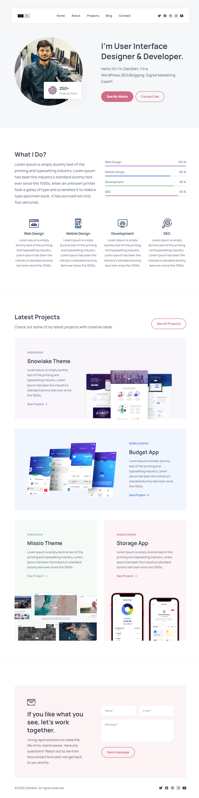

  
  
 

   
   

  <h2 align="center">Julia - Portfolio Website</h2>

  A fully responsive personal portfolio website,  Responsive for all devices, build using HTML, CSS, and JavaScript.

  <a href="https://zabihullahsahi.github.io/Portfilio1/"><strong>➥ Live Demo</strong></a>

 

### Demo Screeshots

### Prerequisites

Before you begin, ensure you have met the following requirements:

* [Git](https://git-scm.com/downloads "Download Git") must be installed on your operating system.

### Contact

If you want to contact with me you can reach me at (https://linktr.ee/zabisahi).

### License

This project is **free to use** and does not contains any license.
